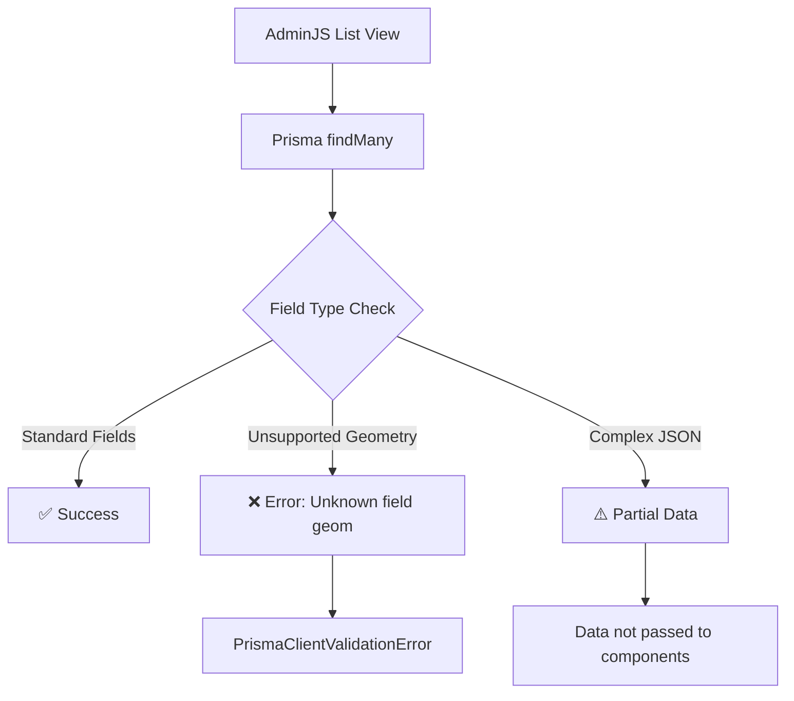
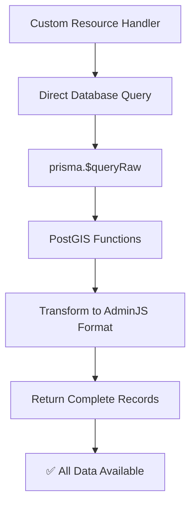
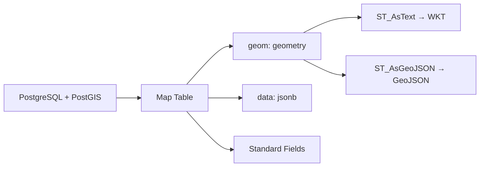
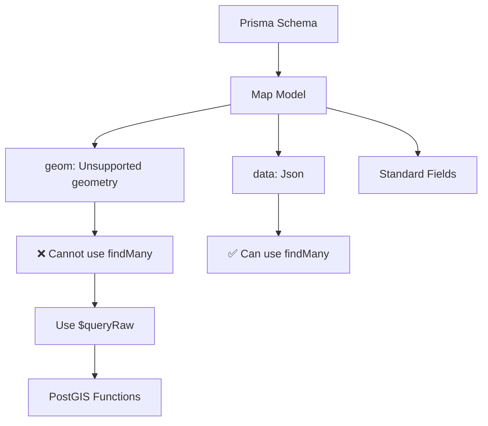
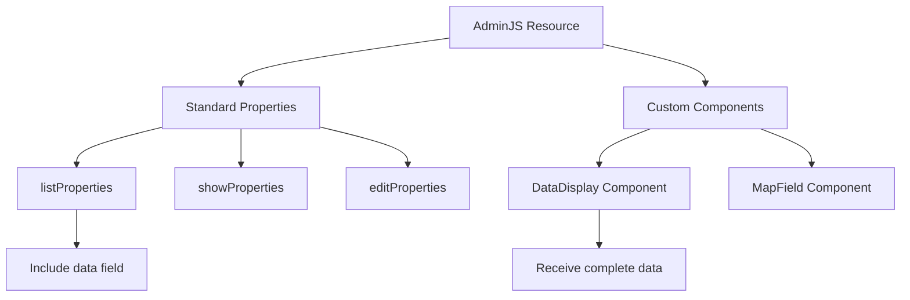
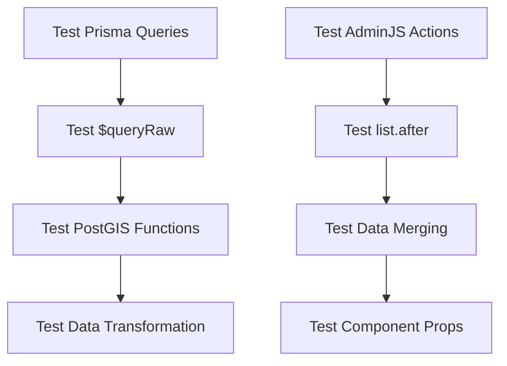
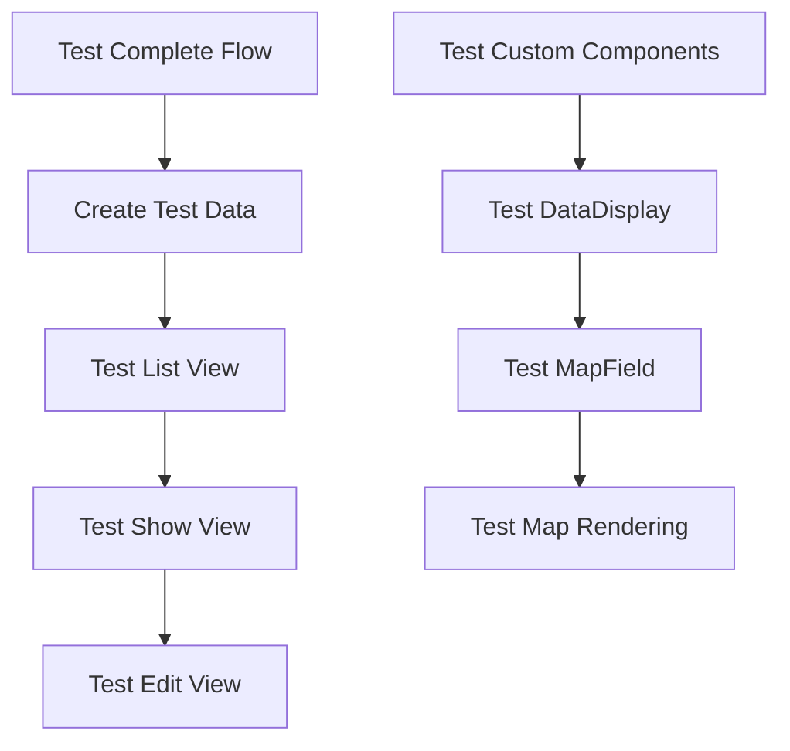
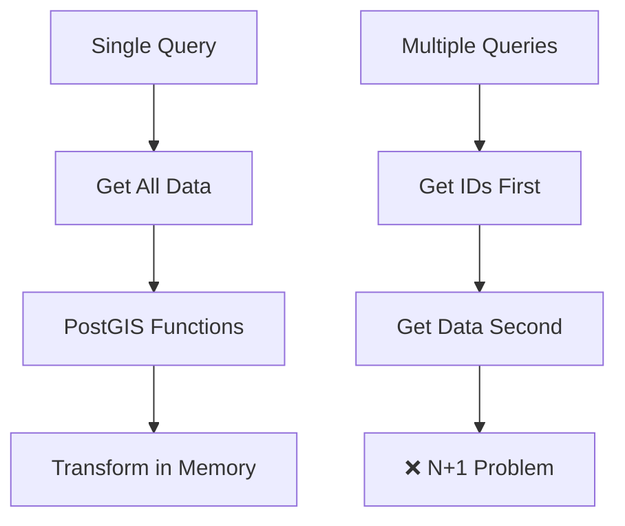
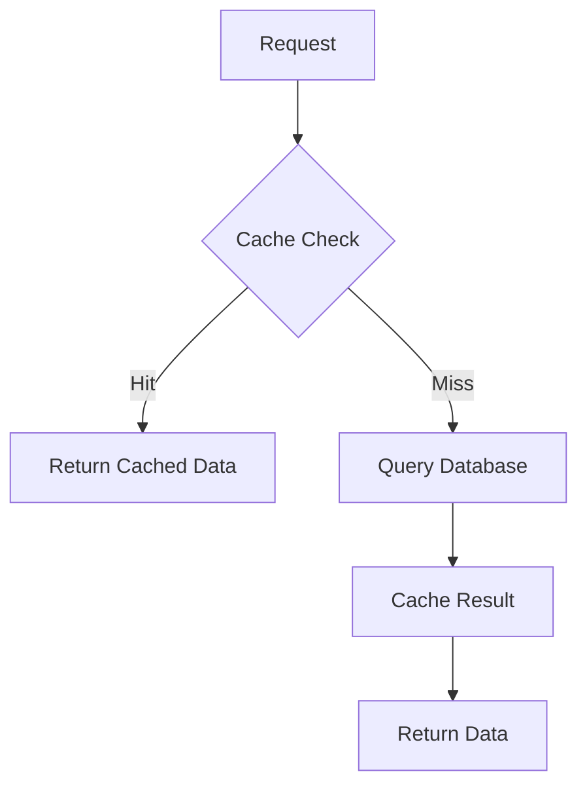
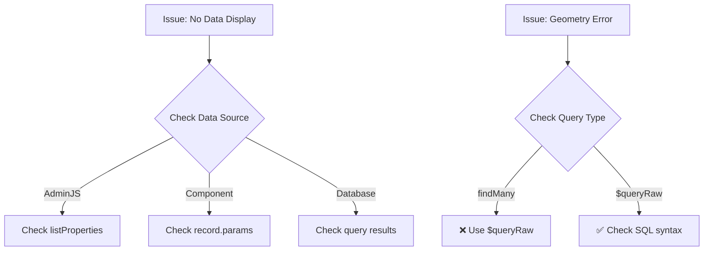

# Prisma Geometry + JSON Data Flow Analysis

## 🔍 ปัญหาที่พบ (Problem Analysis)

### 1. ปัญหาหลัก
- **Prisma ไม่สามารถ select field `geom` ได้โดยตรง** เพราะเป็น `Unsupported("geometry")` ใน schema
- **AdminJS ไม่ส่งข้อมูล `data` และ `geom` มาให้ custom components** โดยอัตโนมัติ
- **ข้อมูล JSON ซับซ้อนแสดงเป็น ellipsis (...)** ใน list view

### 2. สาเหตุของปัญหา


## 🛠️ วิธีแก้ไข (Solution Flow)

### 1. Custom Action Approach
```mermaid
graph TD
    A[AdminJS List Request] --> B[Custom list.after Action]
    B --> C[Extract Record IDs]
    C --> D[prisma.$queryRaw with PostGIS]
    D --> E[ST_AsText & ST_AsGeoJSON]
    E --> F[Merge Data to Response]
    F --> G[✅ Complete Data to Components]
    
    D --> H[Raw SQL Query]
    H --> I[SELECT id, data, ST_AsText(geom), ST_AsGeoJSON(geom)]
```

### 2. Custom Resource Approach


## 📊 Data Flow Architecture

### 1. Database Layer


### 2. Prisma Layer


### 3. AdminJS Layer


## 🧪 Testing Strategy

### 1. Unit Testing


### 2. Integration Testing


## 🔧 Implementation Details

### 1. Prisma Query Pattern
```sql
-- ❌ ไม่ได้ (Prisma findMany)
SELECT id, data, geom FROM "Map" WHERE id IN (...)

-- ✅ ได้ (Prisma $queryRaw)
SELECT 
  id,
  data,
  ST_AsText(geom) as geom_wkt,
  ST_AsGeoJSON(geom) as geom_geojson
FROM "Map" 
WHERE id = ANY($1)
```

### 2. AdminJS Action Pattern
```javascript
// Custom list.after action
actions: {
  list: {
    after: async (response) => {
      // 1. Extract IDs
      const recordIds = response.records.map(record => record.id)
      
      // 2. Query with PostGIS
      const fullData = await prisma.$queryRaw`...`
      
      // 3. Merge data
      response.records.forEach(record => {
        const fullRecord = fullData.find(f => f.id === record.id)
        if (fullRecord) {
          record.params.data = fullRecord.data
          record.params.geom = fullRecord.geom_wkt
        }
      })
      
      return response
    }
  }
}
```

### 3. Component Pattern
```javascript
// DataDisplay Component
const DataDisplay = ({ record, property }) => {
  const value = record?.params?.[property.name]
  
  // Handle JSON data
  if (value && typeof value === 'object') {
    return <JsonDisplay data={value} />
  }
  
  return <Text>ไม่มีข้อมูล</Text>
}
```

## 🎯 Best Practices

### 1. Database Design
- ✅ ใช้ `jsonb` สำหรับ JSON data
- ✅ ใช้ `geometry` สำหรับ PostGIS
- ✅ ใช้ `Unsupported("geometry")` ใน Prisma schema

### 2. Prisma Usage
- ✅ ใช้ `$queryRaw` สำหรับ geometry fields
- ✅ ใช้ `findMany` สำหรับ standard fields
- ✅ ใช้ PostGIS functions (`ST_AsText`, `ST_AsGeoJSON`)

### 3. AdminJS Configuration
- ✅ ใช้ custom actions สำหรับ complex data
- ✅ ใช้ custom components สำหรับ display
- ✅ ระบุ `listProperties` ให้ครบถ้วน

### 4. Component Development
- ✅ Handle null/undefined data
- ✅ Parse JSON data safely
- ✅ Provide fallback UI

## 🚀 Performance Considerations

### 1. Query Optimization


### 2. Caching Strategy


## 📝 Testing Checklist

### 1. Database Testing
- [ ] Test PostGIS functions work
- [ ] Test JSON data storage/retrieval
- [ ] Test geometry conversion
- [ ] Test performance with large datasets

### 2. Prisma Testing
- [ ] Test $queryRaw queries
- [ ] Test data transformation
- [ ] Test error handling
- [ ] Test type safety

### 3. AdminJS Testing
- [ ] Test list view data display
- [ ] Test show view data display
- [ ] Test edit view data input
- [ ] Test custom components

### 4. Component Testing
- [ ] Test DataDisplay component
- [ ] Test MapField component
- [ ] Test error states
- [ ] Test loading states

## 🔍 Debugging Guide

### 1. Common Issues


### 2. Debug Steps
1. **Check Console Logs** - Look for Prisma errors
2. **Check Network Tab** - Verify API responses
3. **Check Component Props** - Verify data flow
4. **Check Database** - Verify data exists

## 📚 Related Files

### 1. Configuration Files
- `page/map.js` - AdminJS resource configuration
- `page/map-custom.js` - Custom resource handler
- `config/loder.js` - Component loader
- `prisma/schema.prisma` - Database schema

### 2. Component Files
- `src/components/featureUi/DataDisplay.jsx` - Data display component
- `src/components/featureUi/MapField.jsx` - Map field component
- `src/components/testmap/viewkml.jsx` - Map view component

### 3. API Files
- `routes/test-kml-import.js` - Test API endpoints
- `page/buildingControl/actions.js` - GeoJSON processing

## 🎉 Success Metrics

### 1. Functional Success
- ✅ Data displays correctly in list view
- ✅ Data displays correctly in show view
- ✅ Data can be edited in edit view
- ✅ Map renders correctly with data

### 2. Performance Success
- ✅ Page loads within 2 seconds
- ✅ No memory leaks
- ✅ Efficient database queries
- ✅ Smooth user experience

---

**สรุป**: ปัญหาหลักคือ Prisma ไม่สามารถ handle PostGIS geometry fields ได้โดยตรง ต้องใช้ `$queryRaw` ร่วมกับ PostGIS functions และสร้าง custom AdminJS actions เพื่อส่งข้อมูลที่สมบูรณ์ไปยัง components
